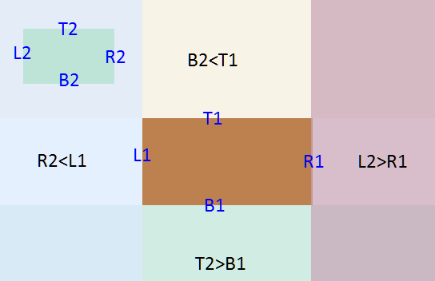
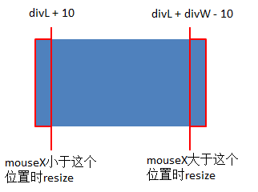

# 1. 基础

```JS
var oImg = document.getElementById('img1');
drag(oImg);
function drag(obj) { // 拖拽函数
	obj.onmousedown = function(ev) { 
		var ev = ev || event;
		// 元素被点击时，获取鼠标位置和当前元素位置的差
		var disX = ev.clientX - this.offsetLeft;
		var disY = ev.clientY - this.offsetTop;
		if ( obj.setCapture ) {  //非标准IE，取消文字、图片默认拖拽效果
			obj.setCapture();
		} 
		// 将鼠标移动事件添加到document上，防止鼠标移动太快，离开元素导致元素不会跟随鼠标移动
		document.onmousemove = function(ev) {
			var ev = ev || event;
			//点击过程中，移动鼠标时，使元素跟随鼠标移动
			obj.style.left = ev.clientX - disX + 'px';
			obj.style.top = ev.clientY - disY + 'px';
		}
		// 将鼠标释放事件添加到document上，防止鼠标在上层元素上释放导致元素会一直跟随鼠标移动
		document.onmouseup = function() {
			// 释放鼠标时，取消move事件，不跟随鼠标移动
			document.onmousemove = document.onmouseup = null;
			if ( obj.releaseCapture ) { // 非标准IE，取消文字、图片默认拖拽效果
				obj.releaseCapture();
			}
		}
		return false;// 标准浏览器，取消文字、图片默认拖拽效果
	}
}
```

# 2. 在可视区内拖拽

```JS
document.onmousemove = function(ev) {
	var ev = ev || event;
	var L = ev.clientX - disX;
	var T = ev.clientY - disY;
	if ( L < 0 ) {
	// 当移动到可视区的最左边时，固定显示在0的位置。
		L = 0;
	}else if ( L > document.documentElement.clientWidth - obj.offsetWidth ) {
	// 当移动到可视区的最右边时，固定显示在最右位置。
		L = document.documentElement.clientWidth - obj.offsetWidth;
	}
	if ( T < 0 ) { // 同上
		T = 0;
	} else if ( T > document.documentElement.clientHeight - obj.offsetHeight ) {
		T = document.documentElement.clientHeight - obj.offsetHeight;
	}
	obj.style.left = L + 'px';// 其他位置可自由移动
	obj.style.top = T + 'px';
}

```

# 3. 拖拽吸附

原理：在移动到某一个范围内，设置成想要的值。

```JS
document.onmousemove = function(ev) {
	var ev = ev || event;
	var L = ev.clientX - disX;
	var T = ev.clientY - disY;
	if ( L < 100 ) {// 在可视区内拖拽的效果上仅修改了这个值
		L = 0;
	} else if ( L > document.documentElement.clientWidth - obj.offsetWidth ) {
		L = document.documentElement.clientWidth - obj.offsetWidth;
	}
	if ( T < 0 ) {
		T = 0;
	} else if ( T > document.documentElement.clientHeight - obj.offsetHeight ) {
		T = document.documentElement.clientHeight - obj.offsetHeight;
	}
	obj.style.left = L + 'px';
	obj.style.top = T + 'px';
	
}

```

# 4. 碰撞检测



```JS
document.onmousemove = function(ev) {
	var ev = ev || event;
	var L = ev.clientX - disX;
	var T = ev.clientY - disY;
	// 获取拖拽元素各边的位置值
	var L1 = L;
	var R1 = L + obj.offsetWidth;
	var T1 = T;
	var B1 = T + obj.offsetHeight;
	// 获取另一元素各边的位置值
	var L2 = oImg.offsetLeft;
	var R2 = L2 + oImg.offsetWidth;
	var T2 = oImg.offsetTop;
	var B2 = T2 + oImg.offsetHeight;
	// 在九宫格中间位置以外的区域都不会发生碰撞
	if ( R1 < L2 || L1 > R2 || B1 < T2 || T1 > B2 ) {
		oImg.src = '1.jpg';
	} else {
		oImg.src = '2.jpg';
	}
	
	obj.style.left = L + 'px';
	obj.style.top = T + 'px';
	
}

```

# 5. 拖拽resize



```JS
var oDiv = document.getElementById('div1');
oDiv.onmousedown = function(ev) {
	var ev = ev || event;
	var disW = this.offsetWidth; // 获取点击时元素的宽度
	var disL = this.offsetLeft; // 获取点击时元素的X轴位置
	var disX = ev.clientX; // 获取点击时鼠标的X轴位置
	var b = '';
	if ( mouseX > divL + divW - 10 ) { 
		b = 'right';
	}
	if ( mouseX < divL + 10 ) {
		b = 'left';
	}
	document.onmousemove = function(ev) {
		var ev = ev || event;
		switch( b ) {
			case 'left': // 点击左边区域时，修改宽度和左边位置
				oDiv.style.width = divW - ( ev.clientX - mouseX ) + 'px';
				oDiv.style.left = divL + ( ev.clientX - mouseX ) + 'px';
				break;
			case 'right':// 点击右边区域时，修改宽度
			oDiv.style.width = divW + ( ev.clientX - mouseX ) + 'px';
				break;
		}
	}
	document.onmouseup = function() {
		document.onmousemove = document.onmouseup = null;
	}
	return false;
}

```

