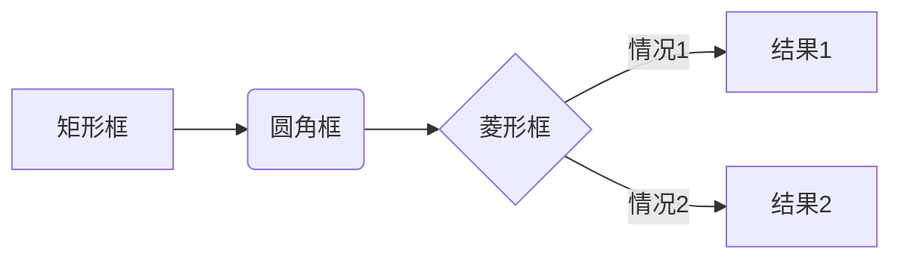

## 基本介绍

Typora是一款**所见即所得**的Markdown文本编辑工具——在你输入相应的标记符号后，系统会自动对所标记的文本进行渲染，设置成相应的格式。因此，写作过程与渲染过程同步出现，最终输出文本就是按照你所看到的格式进行排版。

本文不会介绍markdown语法，仅介绍一些个人觉得好用的功能。

## 代码块语法高亮

操作：选中代码块，在代码块右下角的select a language框中输入语言类型。

```html
<html>
	<head></head>
	<body>
		<div>Hello world!</div>
	</body>
</html>
```

## 关键词高亮

开启高亮：文件->偏好设置->Markdown语法扩展->勾选高亮。

使用：在`==`中插入需要关键词来实现，如:  ==关键词== 。

## 输入emoji表情

😄 `:smile:`

只需要输入`：`和第一个字母即可出现候选的emoji表情。如`:smile`。

## 绘制图表

流程图例子：

```
​```mermaid
graph LR
A[矩形框] -->B(圆角框)
	B --> C{菱形框}
	C -->|情况1| D[结果1]
	C -->|情况2| E[结果2]
​```
```


> Typora自带了[http://flowchart.js.org/](https://link.jianshu.com/?t=http://flowchart.js.org/)插件，所以支持流程图。hexo博客显示不出来，后面在处理。

## 常用快捷键

### 1. 字体相关

加粗：`Ctrl+B`

斜体：`Ctrl+I`

标题：`Ctrl+数字`

下划线：`Ctrl+U`

删除线：`alt+shift+5`

### 2. 操作相关

选中一整行：`ctrl+l`

选中单词：`ctrl+d`

返回开头：`Ctrl+Home`

返回结尾：`Ctrl+End`

替换：`ctrl+h`

显示/隐藏侧边栏： `ctrl+shift+L` 或左下角的第一个按钮

显示/关闭源码模式：`ctrl+/` 或左下角的第二个按钮

### 3. 其他

生成表格：`Ctrl+T`

创建链接：`Ctrl+K`

生成目录：`[TOC]`按回车

插入图片：直接拖动到指定位置即可或者`ctrl+shift+i`

插入链接：`ctrl+k`